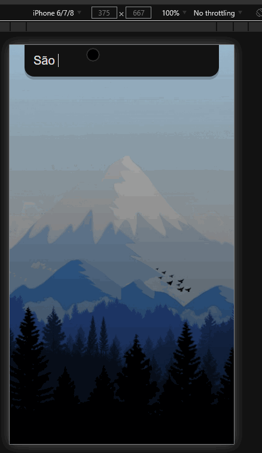

<h1>[React] Weather App</h1>


</br>

📋 App que consome API de previsão do tempo. veja no gif:


## 🚀 <b>Este projeto está online: [`top-weather.app`](https://top-weather.netlify.app/)</b>
</br>

### 🔧 <b>Mais Instruções:</b>
Clonar Repositório:
```bash
git clone https://github.com/thiagoferrari/weather-app.git
```

Instalar dependências (Recomendo [`yarn`](https://classic.yarnpkg.com/en/)):
```bash
yarn install # or npm install
```

Startar projeto (estará online em [http://localhost:3000](http://localhost:3000)):
```bash
yarn start # or npm start
```

### 🎬 Seguimento:
Todos códigos absorvidos deste [`video`](https://youtu.be/GuA0_Z1llYU)